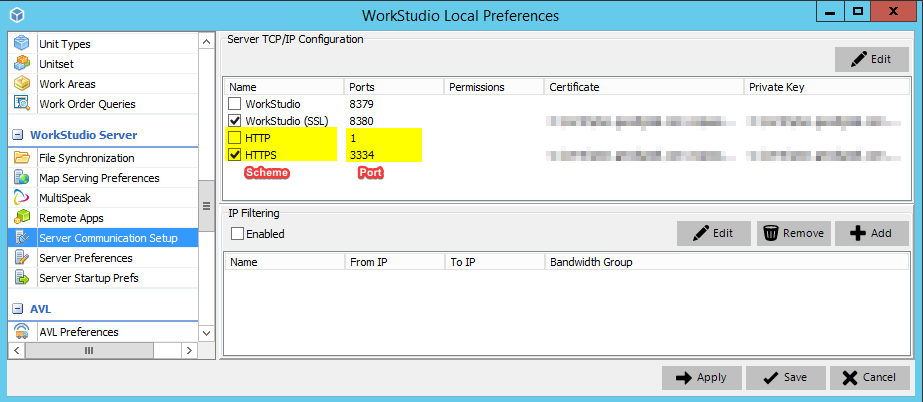
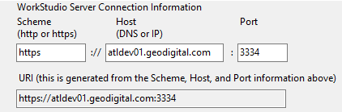
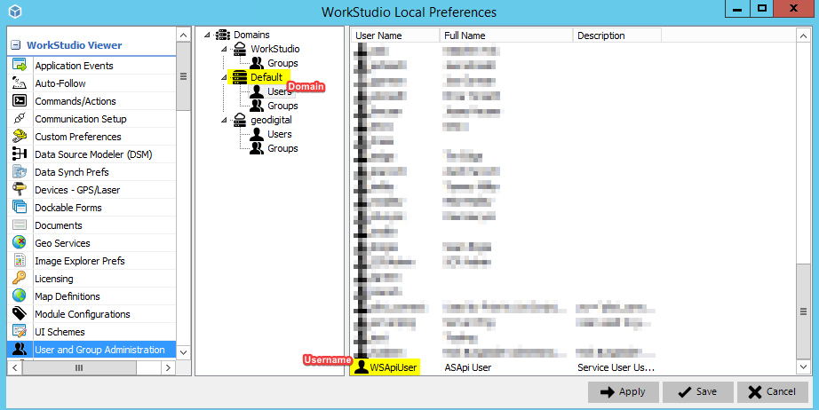
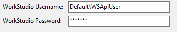
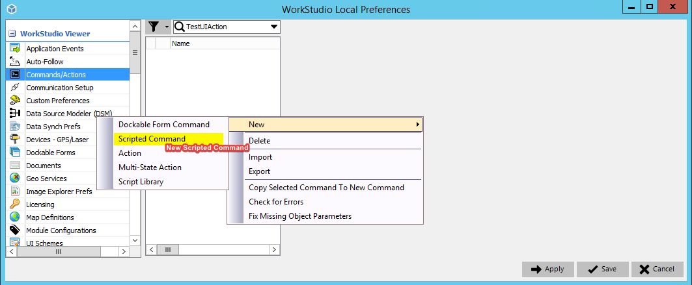
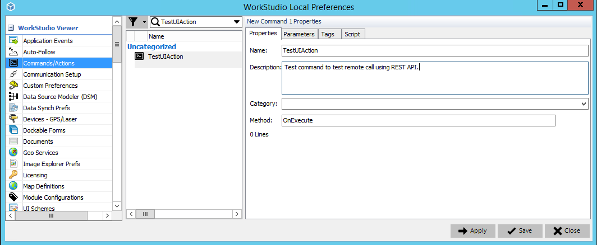
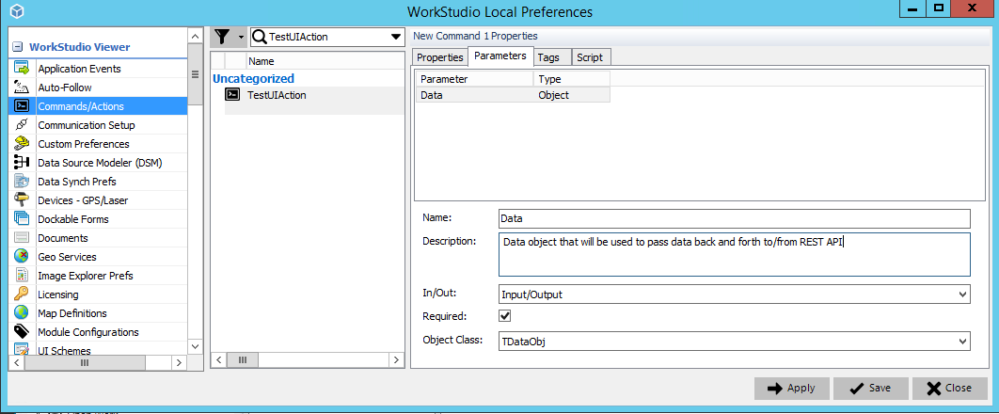
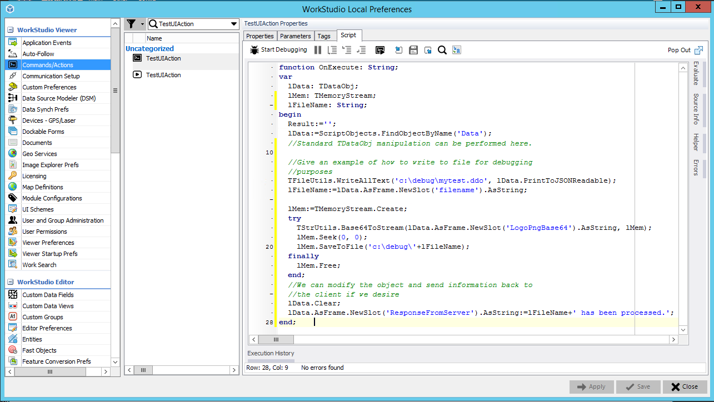
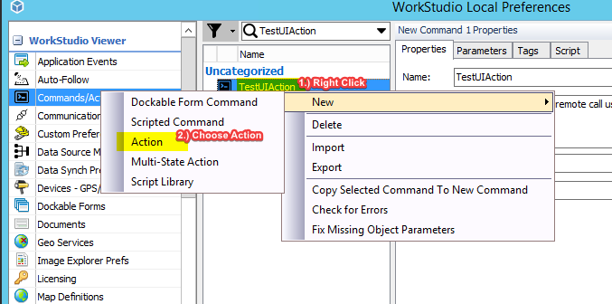
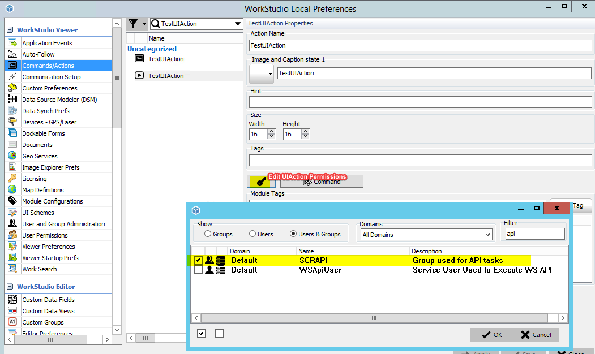

# WorkStudio Rest API C# Examples

This repository contains WorkStudio C# examples using the REST based calls to perform actions on WorkStudio.


# Compilation

Compiled in Visual Studio 2019 16.7.5 with Dot Net Core 3.1


# Configuring Sample Client To Connect to WorkStudio Server

In order to get the sample application to connect WorkStudio server you will need to know some specific network and credential information that has been configured in WorkStudio Server as well has been setup by IT.

<u>Network Configuration</u>

The sample application has a place where you can fill in the **scheme**, **host**, and **port**.  Scheme and host can be gathered from the `WorkStudio Preferences` in the `WorkStudio Server` section and the `Server Communication Setup` frame of the preferences.

**Scheme** - This will either be `http` or `https` depending on which scheme has a check box next to it in the `Server Communication Setup` frame of the `WorkStudio Preferences`.  It should be noted that only schemes that are checked are currently enabled on WorkStudio Server.

**Port** - This will be the port in `Server Communication Setup` frame of the `WorkStudio Preferences` that corresponds to the scheme that was chose.

**Host** - The host is more of an IT departement concern than a WorkStudio Server concern.  Your IT department should be able to setup a DNS that can reach the port specified above or the DNS will already be configured and IT should be able to make you aware of it.  The host also supports using an IP address directly as well if DNS is not setu. Note: Currently only IPv4 is supported.

In the example below, a valid `Scheme` would be `https` and the valid `port` would be `3334`.  For the `Host` setting, we have a DNS that our IT department has setup called `atldev01.geodigital.com` that would qualify as a valid entry.  IT configured `atldev01.geodigital.com` to point to IP Address `10.10.4.17` which means that `10.10.4.17` would also be a valid entry to put in for the `Host`.



As you can see in the screen shot below, the Scheme, Host, and Port have been filled in from the `Server Communication Setup` frame and from the information that the IT department declared.



<u>Credential Configuration</u>

The sample application has a place where you can fill in the **WorkStudio Username** and **WorkStudio Password**.  The user that can be used to execute the API can be gathered from the `WorkStudio Preferences` in the `WorkStudio Viewer` section and the `User and Group Administration` frame of the preferences.  How to configure users here is out of scope for this discussion.  It it important to note that the WorkStudio Username that is used in the API include the domain name followed by a backslash followed by a username.  In the case of the example below the proper username to specify would be `Default\WSApiUser` with the corresponding password.



As you can see in the screen shot below `Default\WSApiUser` has been specified in the WorkStudio Username below.



# Examples

Examples of how to execute a http request against WorkStudio Server is provided in `WSRestApiApp\WSRestApiAppMainForm.cs`.  The form has buttons that illustrates how to execute each example.

Note: Be sure to be mindful of the utility methods that are used as somethings are important to pay attention to:
* Case sensitivity of json properties:  WorkStudio does not gaurantee that the properties of the JSON object will always be of the same case.  ie.. JSON object property names must be treated as thought they are case insensitive.  Utily method WSRestApiUtil.GetJSONValue() was provided as an example of how tow work with that.
* Guids: Guids that are represented as strings in WorkStudio must conform to uppercase type B guid (https://docs.microsoft.com/en-us/dotnet/api/system.guid.tostring?view=netcore-3.1).  There is another utility method WSRestApiUtil.NewGuid() that is provided to show how this works.


### Updating or Creating a Job

**Protocols used**: CREATEEDITSESSION, EDITSESSIONJOBVISUALFIELDUPDATE, SAVEEDITSESSIONJOB, CLOSEEDITSESSION

**Description**: This method gives and example of how an attribute or custom data on a job can be updated.  A lot of times a CIS or some other systme might need to update some header data on a job.  One example might be an address of a customer might want to update a custom field that holds the address in the custom header data.

**Method doing the work**: WSRestApiAppMainForm.UpdateJob()


### Fetching the Unit List

**Protocols used**: GETUNITLIST

**Description**: This method will fetch all of the units that WorkStudio knows of.  NOTE: This method was intended to show how to update a unit as well but that is not yet completed yet.

**Method doing the work**: WSRestApiAppMainForm.UpdateUnit()

### Executing an Action Command

**Protocols used**: EXECUTEUIACTION

**Description**: WorkStudio has a very rich scipting API that gives WorkStudio scripters the ability to perform all sorts of custom workflow tweaks as well as performing other customization.  This example will show how a client can send some data to WorkStudio server to have it execute a custom script (known as a UIAction and ActionCommand) passing it some sort of payload for the script to be able to look at and then return something to the client to work with.

**Method doing the work**: WSRestApiAppMainForm.ExecuteUIAction()

**Setup**: In order for this to work, you will need to have both a Command and UIAction setup on WorkStudio Server.  Start out by setting up a new scripted command or use one that already exists.

In this example, a command named TestUIAction needs to be setup.





In TestUIAction parameters setup a TDataObj Input/Output parameter named Data.



In the `Script` tab, you can put in the following sample script.  This script give a general idea of how to get at the binary ping image and some of the data that was sent from the client.  It also demonstrates how things can be communicated back down to the client.

```Pascal
function OnExecute: String;
var
  lData: TDataObj;
  lMem: TMemoryStream;
  lFileName: String;
begin
  Result:='';
  lData:=ScriptObjects.FindObjectByName('Data');
  //Standard TDataObj manipulation can be performed here.

  //Give an example of how to write to file for debugging
  //purposes
  TFileUtils.WriteAllText('c:\debug\mytest.ddo', lData.PrintToJSONReadable);
  lFileName:=lData.AsFrame.NewSlot('filename').AsString;

  lMem:=TMemoryStream.Create;
  try
    TStrUtils.Base64ToStream(lData.AsFrame.NewSlot('LogoPngBase64').AsString, lMem);
    lMem.Seek(0, 0);
    lMem.SaveToFile('c:\debug\'+lFileName);
  finally
    lMem.Free;
  end;
  //We can modify the object and send information back to
  //the client if we desire
  lData.Clear;
  lData.AsFrame.NewSlot('ResponseFromServer').AsString:=lFileName+' has been processed.';
end;
```



Right click on the TestUIAction command that was created and choose to create an `Action`.



Be sure to give access to the user that will be executing the REST call that was setup in the documentation above.  In our example here, WSApiUser (which was setup above) is a member of the SCRAPI group which means that allowing access to SCRAPI will give access to WSApiUser to execute the UIAction.



# ToDo

- [ ] Handle errors (Example: Authentication failure) with more grace
- [ ] Update unit example
- [ ] JSON is not case sensitive in WorkStudio
- [ ] Update header of new job
- [ ] Update header of existing job (not taken)
- [ ] Update header of existing job (taken)
- [ ] Update header of existing job (job does not exist)
- [ ] Execute a transition on a job
